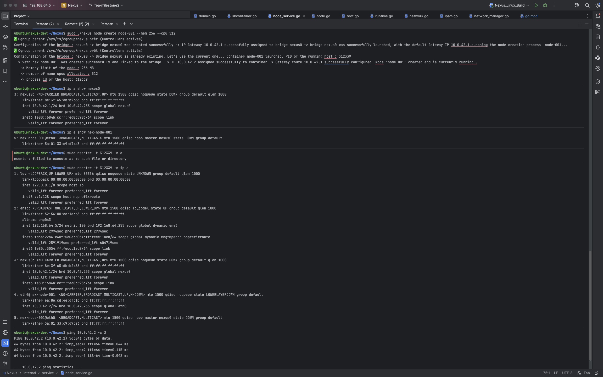

# Nexus Milestone 2: Container Networking

This milestone introduces the network plumbing required to bridge container namespaces with the host environment. I am not using Docker's default bridge or CNI plugins. I am manually manipulating `netlink` sockets to construct virtual ethernet pairs and bridges.

### The Architecture

I implemented a classic **Bridge + Veth** topology:

1.  **Bridge (`nexus0`)**: Acts as a Layer 2 virtual switch on the host. It owns the gateway IP `10.0.42.1`.
2.  **Veth Pair**: A virtual patch cable.
    * **Host End (`nex-{nodeID}`)**: Plugged into the `nexus0` bridge.
    * **Guest End (`eth0`)**: Moved into the container's network namespace and renamed.
3.  **IPAM**: A custom allocator managing the `10.0.42.0/24` subnet.

### Technical Implementation

I bypass shell command wrappers (`exec.Command("ip", ...)`) in favor of direct netlink interactions via `github.com/vishvananda/netlink`.

The orchestration flow is strictly ordered:

1.  **Allocation**: Reserve an IP from the pool (e.g., `10.0.42.2`).
2.  **Namespace Creation**: The runtime spawns the process with `CLONE_NEWNET`.
3.  **Thread Locking**: The Go runtime thread is locked to the OS thread to prevent context switching during namespace manipulation.
4.  **Plumbing**:
    * Create veth pair.
    * Attach host side to bridge.
    * `setns` into the container's namespace file descriptor.
    * Move guest interface, rename to `eth0`, assign IP, and bring up `lo`.
    * Inject default route (`0.0.0.0/0 via 10.0.42.1`).
5.  **Rollback**: Return thread to host namespace and unlock.

### Environment Requirements

* **Capabilities**: `CAP_NET_ADMIN` is strictly required.
* **Kernel modules**: `bridge`, `veth`.
* **Previous Dependencies**: All requirements from Milestone 1 apply.

### Usage

The interface remains consistent. Networking is now implicit during node creation.

```bash
# Build
go build -o nexus

# Create a node (Network setup is automatic)
sudo ./nexus node create node-001 --mem 256 --cpu 512
```

### Verification & Proof

The following evidence demonstrates successful network isolation and routing.

1.  **Bridge Status**: The host sees `nexus0` UP with the gateway IP.
2.  **Container Interface**: The container possesses `eth0` with the assigned IP `10.0.42.2`.
3.  **Connectivity**: ICMP (Ping) packets successfully traverse from Host -\> Bridge -\> Veth -\> Container.

**Terminal Evidence:**

\

*As shown above, the container `node-001` responds to pings with \<0.1ms latency, confirming the virtual link is active and routing table is correct.*

### Limitations to be overcome next (Milestone 2)

* IPAM is currently ephemeral (in-memory). Restarting the daemon resets the pool.
* No NAT/Masquerading is configured yet; containers can talk to the host, but not the internet.
* DNS is not configured inside the container (uses `/etc/resolv.conf` from host or empty).